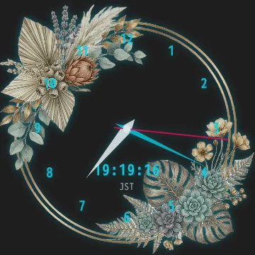

# Lain Clock

Desktop clock widget built with Tauri v2 — the desktop edition of the Analog Clock UI on [lain-lab.com](https://lain-lab.com/featured/analog-clock-guide/).




## 🛠️ Features

- Transparent, frameless, always-on-top analog clock
- System config window: dial type (Arabic / Roman), radius, font, colors, size
- Background skins: 8 presets + add your own images (stored locally, never uploaded)
- 3 preset slots, JSON export / import of settings
- Ticking sound and hourly chime
- Tray icon (show / hide / config / quit)
- Remembers window position
- Cross-platform: Windows, macOS (Intel & Apple Silicon), Linux

## 🚀 Download

Get the latest installer from the Releases page:

👉 [Download Lain Clock](https://github.com/fixtan/lain-clock/releases/latest)

| OS | File |
|---|---|
| Windows | `lain-clock_x.x.x_x64-setup.exe` (or `.msi`) |
| macOS | `lain-clock_x.x.x_universal.dmg` |
| Linux (Debian / Ubuntu) | `lain-clock_x.x.x_amd64.deb` |
| Linux (portable) | `lain-clock_x.x.x_amd64.AppImage` |

**macOS:** if you see "cannot verify the developer", open System Settings → Privacy & Security → **Open Anyway**.

## 🖱️ Usage

- **Drag** the clock to move it
- **Right-click** for the menu (config, sound, dial numbers, digital clock, hide, quit)
- Hidden clocks come back from the **tray icon**

Guide (Japanese): https://lain-lab.com/featured/analog-clock-guide/

## 🔨 Development

1. Install [Rust](https://www.rust-lang.org/) and [Node.js](https://nodejs.org/)
2. Install dependencies
   ```bash
   npm install
   ```
3. Run in dev mode
   ```bash
   npm run dev
   ```

Releases are built by GitHub Actions when a `v*` tag is pushed.

## 📝 License

Source code: MIT or Apache 2.0.

Sound effects are from [効果音ラボ (Sound Effect Lab)](https://soundeffect-lab.info/) and skin images are not covered by this license.
